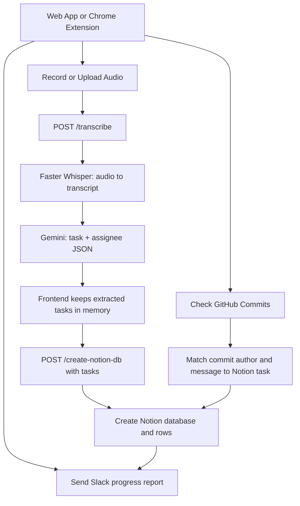

# End-to-End Workflow

This project is driven by the frontend controls. The app does not store a meeting summary JSON file.

## Visual Overview



## Workflow 1: Audio To Extracted Tasks

```text
web_app/app.js or extension/popup.js
  -> POST /transcribe
  -> backend/server.py
  -> backend/app.py
  -> Whisper transcript
  -> Gemini extracts task and assignee objects
  -> frontend stores those tasks in memory
```

No Notion database is created during this step.

## Workflow 2: Extracted Tasks To Notion

When `Create Notion DB` is clicked:

```text
frontend sends the extracted task list
  -> server.py validates the task list
  -> sync_pipeline.py creates a new Notion database
  -> each task becomes one Notion row
```

If task names or assignees need correction later, edit them directly in Notion.

## Workflow 3: GitHub Commit To Notion Status

```text
Check GitHub Commits
  -> fetch commits from the last 24 hours
  -> use USER_MAPPING_JSON or backend/user_mapping.json to identify the assignee
  -> compare commit message words with task text
  -> mark only the matching task as Done
```

Already-done Notion tasks are skipped, so repeated checks do not need a local SHA state file.

## Workflow 4: Slack Report

```text
Send Progress Report
  -> read active Notion DATABASE_ID
  -> group tasks by assignee
  -> include Done and Not Done tasks
  -> send one Slack message
```
