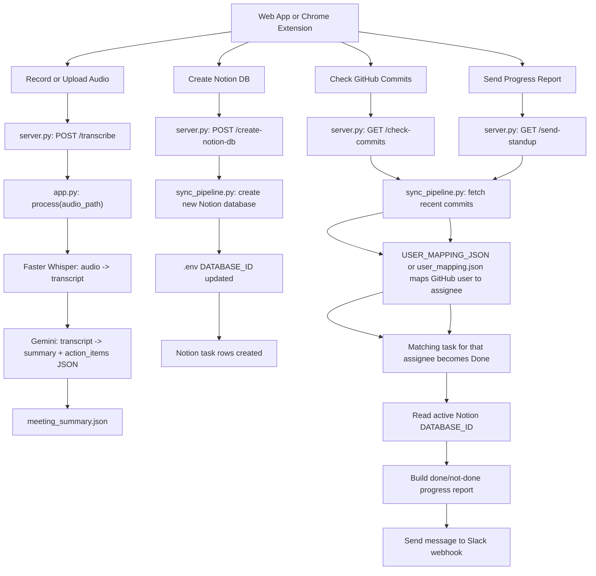

# End-to-End Workflow

This project has three main user actions:

1. Record or upload meeting audio.
2. Check GitHub commits.
3. Send a Slack progress report.

Each action starts in the web app or extension, then calls the Flask backend.

## Visual Overview



## Workflow 1: Meeting Audio To Summary JSON

The user records or uploads audio from either frontend.

```text
web_app/app.js or extension/popup.js
  sends POST /transcribe with:
  - audio file
  - meeting title
```

Then Flask receives the request:

```text
backend/server.py
  transcribe_audio()
  - saves uploaded audio as a temporary file
  - calls process(temp_audio_path)
```

The AI work happens in:

```text
backend/app.py
  process(audio_path)
  - calls transcribe(audio_path)
  - sends transcript to Gemini
  - writes meeting_summary.json
```

After Gemini creates the summary, the UI shows the readable summary. No Notion database is created yet.

## Workflow 2: Summary JSON To Notion Tasks

The user clicks `Create Notion DB` after the summary exists.

```text
web_app/app.js or extension/popup.js
  calls POST /create-notion-db
```

Flask receives the request:

```text
backend/server.py
  create_notion_db()
  - calls import_meeting_tasks(fresh_database=True)
```

The Notion task work happens in:

```text
backend/sync_pipeline.py
  import_meeting_tasks(fresh_database=True)
  - reads meeting_summary.json
  - creates a new Notion database under PARENT_PAGE_ID
  - updates DATABASE_ID in .env
  - creates task rows inside that database
```

Why this jumps between files:

```text
server.py owns HTTP requests.
app.py owns AI processing.
sync_pipeline.py owns external workflow integrations.
```

Keeping those jobs separate makes the code easier to change. For example, you can edit Gemini prompts in `app.py` without touching the Notion or Slack logic.

## Workflow 3: GitHub Commit To Notion Status Update

The user clicks `Check GitHub Commits`.

```text
web_app/app.js or extension/popup.js
  calls GET /check-commits
```

Flask forwards the request:

```text
backend/server.py
  check_commits()
  - calls sync_once(send_slack=False)
```

The sync logic handles the real work:

```text
backend/sync_pipeline.py
  sync_once()
  - fetches recent commits from GitHub
  - compares commits with .sync_state.json
  - maps commit author using USER_MAPPING_JSON or user_mapping.json
  - reads tasks from the active Notion DATABASE_ID
  - matches the commit message to that member's task text
  - marks only the matching task as Done
```

Important rule:

```text
One commit marks one matching task done. If the commit message does not match a task, no task is changed.
```

## Workflow 4: Slack Progress Report

The user clicks `Send Progress Report`.

```text
web_app/app.js or extension/popup.js
  calls GET /send-standup
```

Flask routes the request:

```text
backend/server.py
  send_standup()
  - calls sync_once(send_slack=True, force_slack=True)
```

The sync pipeline:

```text
backend/sync_pipeline.py
  sync_once()
  - checks commits again
  - updates Notion if needed
  - reads all current tasks from Notion
  - groups tasks by assignee
  - creates one Slack message
  - sends it to SLACK_WEBHOOK_URL
```

The Slack message includes:

- assignee name
- recent commit messages
- done tasks
- not-done tasks
- overall progress summary

## Active Data Files

```text
meeting_summary.json
  latest Gemini summary and action_items

USER_MAPPING_JSON or user_mapping.json
  maps GitHub username -> Notion assignee -> Slack display name

.sync_state.json
  remembers the last GitHub commit checked

.env
  stores API keys, parent page id, and active Notion DATABASE_ID
```

`meeting_summary.json` is used for creating tasks. GitHub and Slack use the active Notion database from `.env`.
